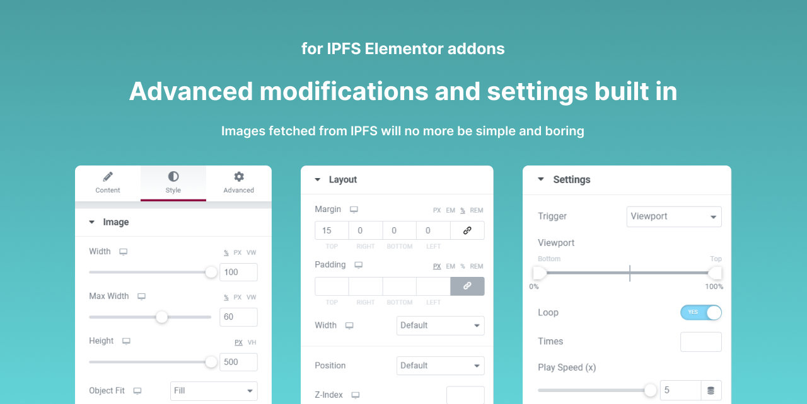

    
    <h1>IPFS for WordPress</h1>
    <strong>The all-in-one plugin that provides powerful & comprehensive IPFS solutions for WordPress CMS.</strong>

 

## Download and installation guide

The "IPFS for WordPress" plugin is ready to download and install on your WordPress site, here's how:

1. Click on a zip file, which has a file name of `ipfs-for-wp.zip`. This is the WordPress plugin file you are looking for.
2. Download it onto your local computer.
3. Go to your WordPress admin panel > "Plugins" tab > Click "Add New" > Click "Upload Plugin"
4. Upload the `ipfs-for-wp.zip` plugin file, wait for the install, and you are ready to go!

## Features Overview

Here is a **features overview (TL;DR)**  of the "IPFS for WordPress" plugin:

* APIs support for IPFS storage tools
* Media libraries for IPFS storage tools
* On-the-spot upload & retrieve for IPFS storage tools
* Lottie animation support for IPFS
* Elementor addons for IPFS integrations
* IPFS integration for WooCommerce
* IPFS image generation system
* IPFS Content Delivery Network (ICDN) for WordPress 

### ✔️ APIs support for IPFS storage tools

Users can choose which IPFS storage tools to use by enabling them in the configuration tab of their plugin admin panel, and easily connect their IPFS storage tools with the help of APIs keys and secrets created from their storage tools account. The dashboard of the plugin will also display the APIs connection status of their IPFS storage tools. Users can now easily set up the plugin and are ready to use all the IPFS features just with a few simple configuration steps. With the APIs support, media assets and files can be seamlessly retrieved from users' IPFS storage tools (IPFS network) and also able to upload anything with one click. Every feature of the plugin will be hassle-free with the APIs support, and users can just focus on their integration, site-building as well as all the IPFS tasks in one place, which is WordPress.

### ✔️ Media libraries for IPFS storage tools

Every IPFS storage tool (Pinata, Web3.Storage, Nft.Storage) will have its own individual media library and be able to access all of them in the plugin admin panel. In other words, when users retrieve images from IPFS storage tools, the images will be added to the respective media library and can be easily managed. Worth mentioning that the media retrieving process is just a few simple clicks and your IPFS-retrieved images are ready to use on your WP site. Not only displaying the images retrieved from the IPFS storage tools, but users can also edit the image details with our image lightbox editor, and apply SEO to the IPFS-retrieved image assets. Furthermore, by toggling on the IPFS image block (Elementor addons) at the dashboard, users can now easily use their IPFS-retrieved images on their WP site with the help of the popular WordPress website builder, Elementor.

### ✔️On-the-spot upload & retrieve for IPFS storage tools

Remember that, one of the aims of this plugin is to help WordPress sites (Web2.0) to implement IPFS solutions (Web3.0) with ease. Hence, the plugin has built-in a feature to let users directly transfer media assets that are originally stored on the server storage to the IPFS network (via IPFS storage tools: Pinata, Web3.Storage, Nft.Storage) with just a few simple clicks. The whole process looks like this:

> **Choose an image in `media` > Click "Upload Image to IPFS" > Choose a IPFS storage tools > Hit the upload button and we are done!**

The image stored on the local media library will be uploaded to the IPFS network, and the IPFS storage tool chosen will return the image CID to the plugin. The image will be then retrieved and stored on the respective IPFS media library of the plugin, and the image (which is now retrieved from IPFS) is now ready to use on the WordPress site. **So, we can see how the image in traditional server storage is stored on the IPFS network and act as the source of the image on the WordPress site, with just a few simple steps.**The image in the local media storage can be deleted or leave it as a future reference, however, user can now have an extra choice to let IPFS as the image source during the site building.

### ✔️ Lottie animation support for IPFS

> Lottie is an open-source animation file format that’s tiny, high quality, interactive, and can be manipulated at runtime. 600% smaller when compared to GIF and 10 times faster to ship. It is definitely the go-to choice when implementing animation on your website. Plus, we can now manage our Lottie animation with IPFS!

User can upload their Lottie JSON file onto IPFS storage tools (Pinata, Web3.Storage, Nft.Storage), and later retrieve it to store it in the specially built Lottie JSON library of the plugin. Similar to media assets, users can also edit the JSON files with the lightbox editor, making SEO possible to apply to the Lottie animations. Together with this plugin, users can toggle on the Lottie animation addon for Elementor and use their Lottie JSON asset retrieved from IPFS for their WP site-building. The IPFS Lottie animation block on Elementor will process and render the animation of the IPFS-retrieved Lottie JSON files, as well as provide advanced customization to let users have full control of their Lottie animation. 

### ✔️ Elementor addons for IPFS integrations

Elementor is a popular WordPress website builder which is suitable for beginners as well as advanced developers. When IPFS integration meets Elementor, there are endless possibilities and make everything of site building so simple.  We had built in several IPFS Elementor addons for this plugin and users just have to toggle it on at the dashboard, and they will be able to use it in the Elementor website builder. There are six IPFS Elementor addons in this plugin:

* Image for Pinata
* Image for Web3.Storage
* Image for Nft.Storage
* Lottie Animation for Pinata
* Lottie Animation for Web3.Storage
* Lottie Animation for Nft.Storage

>**👉 Here's a demo landing page built using the IPFS Elementor addons | [Click here to visit](https://landing.tanzhixuan.com/)**

Furthermore, all the addons (IPFS Elementor blocks) were built-in with various advanced CSS settings and customizations, which can be accessed from the individual block settings. Styling of IPFS-retrieved images on the WordPress site is possible and much more user-friendly with the help of the IPFS Elementor addons.

### ✔️ IPFS integration for WooCommerce

If you are running an eCommerce store with thousands of products, product images will probably occupy a large amount of space in your hosting server, and it is costly to upgrade your server storage and maintain it in the long run. Now, with the power of IPFS, you can run a big eCommerce store with just a small hosting server. 

WooCommerce is the most popular open-source eCommerce solution on WordPress and we had built an integration with IPFS. Users can now upload all of their product images onto IPFS storage tools (Pinata, Web3.Storage,  Nft.Storage) and use them on their online store by retrieving them to the specially-built WooCommerce library of the plugin. The WooCommerce library of the plugin has a specially developed IPFS image generation system built in which supports the optimization process of the IPFS-retrieved product image (will talk more in the next section). When users wanted to add a new product to their WooCommerce online store, they can choose the IPFS-retrieved product image from the plugin's WooCommerce library. **Hooray! Running your WooCommerce (eCommerce) online store with IPFS is not a dream anymore.**

### ✔️ IPFS image generation system

By default, whenever we upload an image to WordPress, WordPress will automatically create a few different sizes of the same image. Users don’t have to keep resizing images manually to ensure the best image size is selected for different locations on your website. However, images retrieved from IPFS storage tools (Pinata, Web3.Storage,  Nft.Storage) will not have this image generation process. Hence, a specially-designed image generation system is built into the plugin to process all the images retrieved from the IPFS network and added to the libraries of the plugin. 

When an image is retrieved from the IPFS network, the IPFS image generation system will generate different resolutions (size) of that image and pack them into a folder, and then upload it back to the IPFS network. The CID of that folder containing different size variants of that image will be stored in the local site database to keep track of the folder. When the site needs to render a specific size of that image, the system will locate the image folder (via CID) and retrieve the image size needed from the folder. The IPFS image generation system supports the product image size optimization of WooCommerce (when integrating with IPFS), allows users to manually select image sizes for their WP site in Elementor, and also powers the thumbnail system of the IPFS libraries itself. 

Here is a simple diagram showing how the image generation process works, as well as the communication between the WordPress backend and IPFS storage tools:

### ✔️ IPFS Content Delivery Network (ICDN) for WordPress

> One of the must-haves when it comes to WordPress website speed is a content delivery network (CDN). A CDN takes the load off your web server and speeds up content delivery to all site visitors. As a result, everything from your user experience to search engine potential improves! However, running a CDN (Cloudflare, RocketCDN, etc.) for your WordPress website might be costly in the long run. **Hence, the first IPFS Content Delivery Network (ICDN) for WordPress comes to the rescue, giving everyone the chance to run a CDN solution for their WP website, but in a cheaper (or even FOC) and efficient way. All thanks to the power of IPFS technology!** IPFS nodes will play the role of "POP" (point of presence) in an ICDN network, replacing the traditional CDN server.

Users just need to enable the ICDN and choose the preferred IPFS storage tools (act as the ICDN provider), that's it! Simple and fast activation, and no more wasting time on complicated CDN settings. For ICDN, everything is simplified and even a newbie can implement a CDN solution for their website. The plugin will automatically rebuild the ICDN cache (based on the lifespan) and update it on the IPFS storage tools. Fully automated and hassle-free for users! In addition, the plugin provides a "one-click instant rebuild" for users who like to rebuild and upload their CDN cache manually at some time. 

ICDN also provides an extra feature - Automated File Minification. CSS dan JS minification is a way to optimize your site performance by reducing whitespaces and comments to reduce file size. When users enable it,  ICDN will automatically store minified variants on the IPFS network, while keeping the uncompressed JS and CSS files on your main server. 

Here is a simple diagram to illustrate how the ICDN works:

